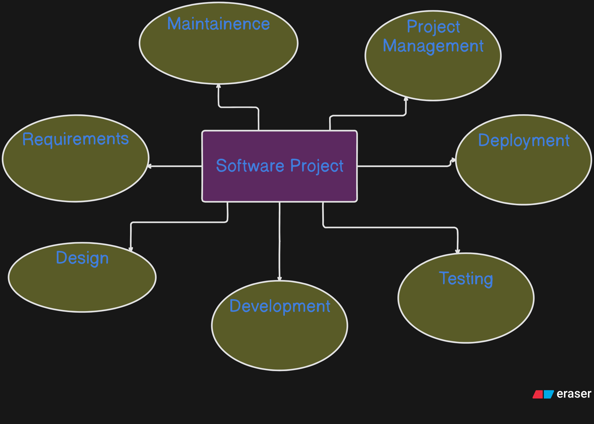
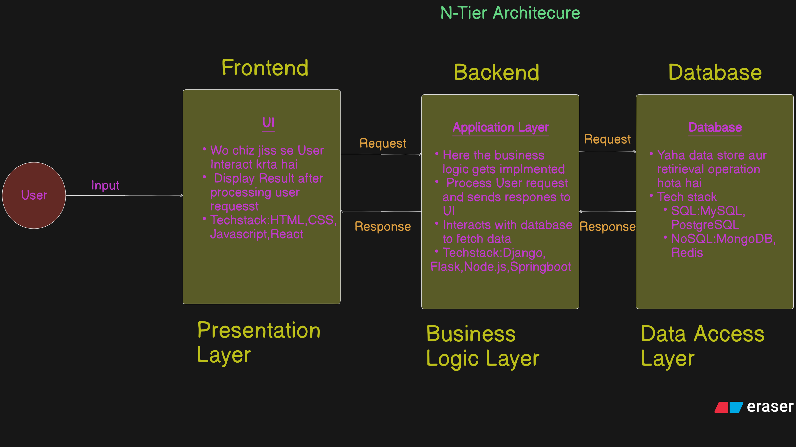
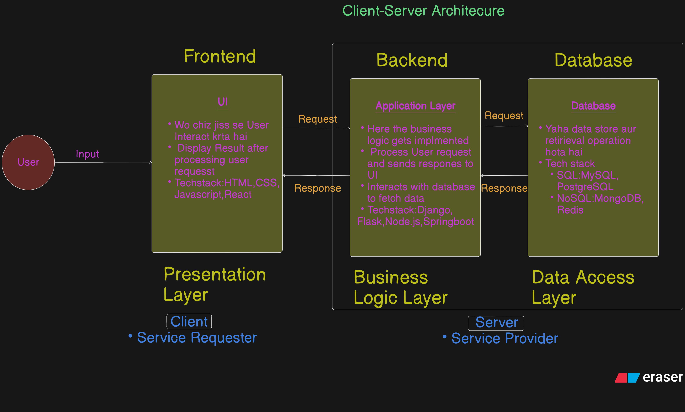
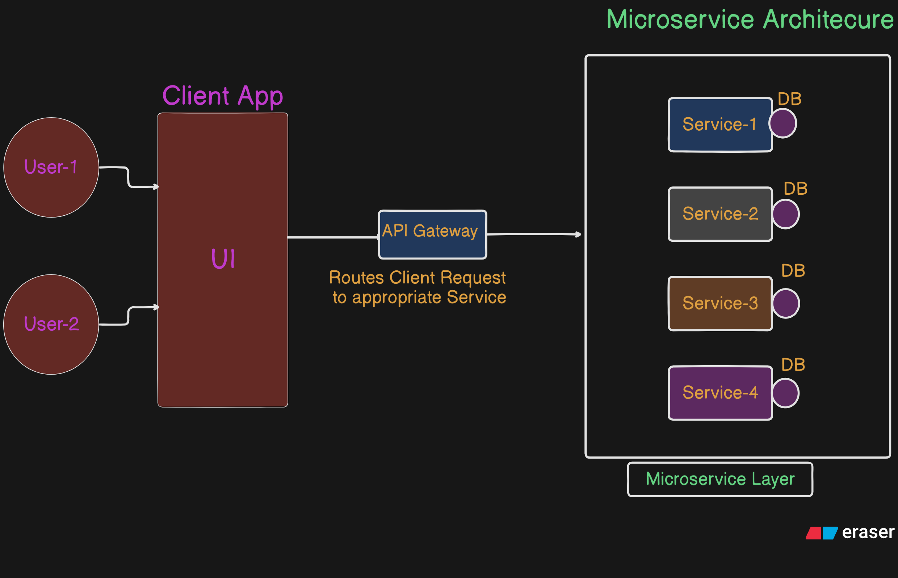
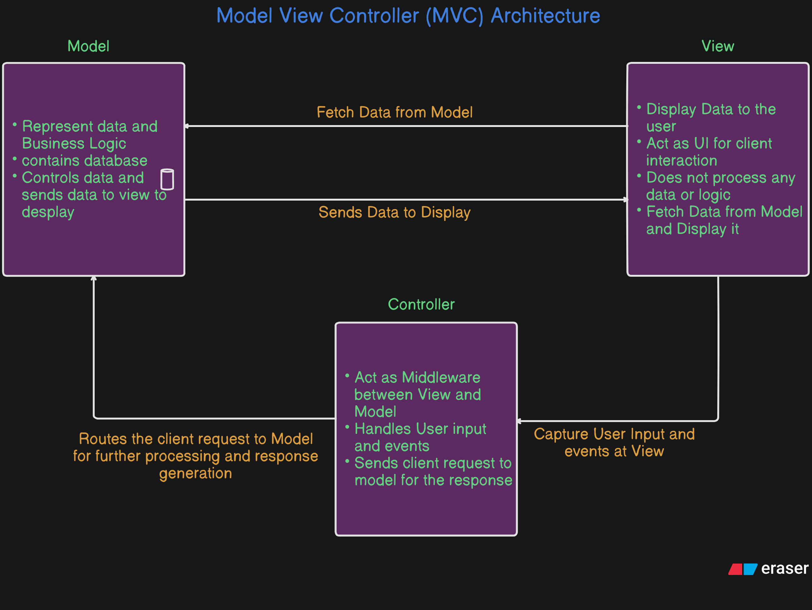

<!DOCTYPE html>
<html lang="en">
<head>
    <meta charset="UTF-8">
    <meta name="viewport" content="width=device-width, initial-scale=1.0">
    <title>Introduction to Computer</title>
    <style>
        body {
            font-family: Arial, sans-serif;
        }
        .navbar {
            overflow: hidden;
            background-color: #333;
        }
        .navbar a {
            float: left;
            display: block;
            color: #f2f2f2;
            text-align: center;
            padding: 14px 20px;
            text-decoration: none;
        }
        .navbar a:hover {
            background-color: #ddd;
            color: black;
        }
    </style>
</head>
<body>

<div class="navbar">
    <a href="#t1">Software Project</a>
    <a href="#t2">Software Project Architecutre</a>
    <a href="#t3">Teams in a Software Project</a>
    <a href="#t4">Devops Basics</a>
    <a href="#t5">Break and Continue keyword </a>
</div>

# <span style="color: #a7c957">Devops Introduction</span>

## <span id="t1" style="color:orange">Software Project</span>

A **software project** refers to the process and organized effort to develop a software application, system, or solution. It encompasses everything from planning, designing, coding, testing, deployment, to maintenance of the software product.


---

### 🔹 What is a Software Project?

A **software project** is a structured plan of action for creating a software product. It includes a set of tasks, allocated resources, schedules, and defined goals, often following a particular **software development lifecycle (SDLC)** such as Agile, Waterfall, or DevOps.

---

### 🔹 Components of Any Software Project

A typical software project has the following **core components**:

1. **Requirements Specification**

   - Functional & Non-functional requirements
   - User stories or use cases

2. **Design**

   - System architecture
   - Database design (ER diagrams, schemas)
   - UI/UX design (wireframes, prototypes)

3. **Development**

   - Source code (frontend, backend)
   - API services
   - Libraries and frameworks used

4. **Testing**

   - Unit testing
   - Integration testing
   - System and Acceptance testing
   - Test cases & automation

5. **Deployment**

   - CI/CD pipelines
   - Cloud infrastructure or servers
   - Containerization (Docker, Kubernetes)

6. **Documentation**

   - Technical documentation
   - User manuals
   - Code comments & README files

7. **Project Management**

   - Timeline planning
   - Team collaboration
   - Version control (Git)
   - Task tracking (JIRA, Trello)

8. **Maintenance & Support**

   - Bug fixing
   - Performance enhancements
   - User feedback loop

---

### 🔹 Types of Software Projects

Software projects can be classified by purpose, complexity, and scale:

| **Type**                 | **Description**                                     |
| ------------------------ | --------------------------------------------------- |
| **System Software**      | OS, compilers, drivers, etc.                        |
| **Application Software** | End-user tools like CRMs, games, office apps        |
| **Web Applications**     | Websites, SaaS platforms, e-commerce systems        |
| **Mobile Applications**  | Android/iOS apps                                    |
| **Embedded Software**    | Used in hardware like IoT devices, robots           |
| **AI/ML Projects**       | Image recognition, chatbots, recommendation systems |
| **Enterprise Software**  | Large-scale apps (ERP, HRM, SCM)                    |
| **Database Projects**    | Data warehousing, business intelligence, analytics  |
| **Cloud-Native Apps**    | Serverless apps, microservices architecture         |
| **Open Source Projects** | Community-driven, open codebase                     |

---

### 🔹 General Architecture of a Software Project

A standard software project architecture typically follows one of these structures:

#### 1. **Layered (N-Tier) Architecture**

```
[Presentation Layer] → UI/UX, Frontend
[Business Logic Layer] → Core logic, Services
[Data Access Layer] → Database interaction
[Database Layer] → SQL/NoSQL DB
```

#### 2. **Client-Server Architecture**

```
[Client] → Web/Mobile App
       ↕ API/HTTP
[Server] → Processes request, connects to DB
```

#### 3. **Microservices Architecture**

- App is split into small services (Auth, Payment, Product, etc.)
- Each service communicates via APIs
- Deployed independently

#### 4. **Event-Driven Architecture**

- Components communicate through events
- Used in real-time systems and IoT

#### 5. **MVC (Model-View-Controller)**

```
Model → Handles data & business rules
View → User Interface
Controller → Processes user input and updates model/view
```

---

### ✅ Summary

| **Aspect**          | **Details**                                                    |
| ------------------- | -------------------------------------------------------------- |
| **Definition**      | A structured activity to build and deliver a software solution |
| **Core Components** | Requirements, design, development, testing, deployment, docs   |
| **Types**           | Web, mobile, embedded, AI, enterprise, open source             |
| **Architectures**   | Layered, Client-server, Microservices, MVC, Event-driven       |

---

## <span id="t2" style="color:orange">Software Project Architecture

- N-Tier Architecture
- Client Server Architecture
- MVC Architecture
- Microservice Architecture

## <span style="color:#219ebc">N-Tier Architecture</span>

**N-Tier Architecture** is a software architecture model that separates an application into **logical layers** (tiers), each responsible for a distinct concern. The most common structure is **3-Tier Architecture**, though "N" can be more than 3 (e.g., adding a caching tier, service tier, etc.).



### ✅ Key Purpose:

- **Separation of Concerns** (SoC)
- **Scalability**
- **Maintainability**
- **Security**
- **Reusability**

---

## 📚 Standard 3-Tier Architecture Overview:

```
1. Presentation Layer (Client/UI)
2. Business Logic Layer (Application/Service)
3. Data Access Layer (Database)
```

Each layer communicates **only with its adjacent layer**, not all other layers directly.

---

## 🔍 Detailed Explanation of Each Layer

---

### 🔸 1. Presentation Layer (UI Tier / Client Layer)

#### 📌 **Function:**

- The **user interface** of the application.
- Collects user input and displays output.
- Sends requests to the Business Logic Layer.

#### 📦 **Responsibilities:**

- Rendering UI components
- Form validation (basic)
- User authentication UI
- Calling API endpoints

#### 🛠️ **Technologies Used:**

- **Web:**

  - HTML, CSS, JavaScript
  - Frameworks: React, Angular, Vue.js

- **Mobile:**

  - Android (Kotlin/Java), iOS (Swift)
  - Flutter, React Native

- **Desktop:**

  - Electron, WPF, JavaFX

#### 🔗 Communicates via:

- HTTP/HTTPS REST or GraphQL API calls to the backend

---

### 🔸 2. Business Logic Layer (Application Tier / Service Layer)

#### 📌 **Function:**

- Processes the application's **core logic**.
- Validates data, enforces rules, manages workflows.
- Communicates with the Data Layer for persistence.

#### 📦 **Responsibilities:**

- Authentication, Authorization
- Payment processing
- Business rule enforcement
- Sending notifications, logging
- Calling external services/APIs

#### 🛠️ **Technologies Used:**

- **Languages & Frameworks:**

  - Node.js (Express.js)
  - Python (Django, Flask, FastAPI)
  - Java (Spring Boot)
  - C# (.NET Core)
  - Ruby (Rails)

- **API Styles:** RESTful, GraphQL, gRPC
- **Middleware:** JSON parsing, logging, security

#### 🔗 Communicates via:

- Internal APIs / service calls to the Data Layer

---

### 🔸 3. Data Access Layer (Persistence Tier / Database Tier)

#### 📌 **Function:**

- Manages all **data storage and retrieval** operations.
- Provides a structured interface to the database.

#### 📦 **Responsibilities:**

- Executing SQL queries
- Object-Relational Mapping (ORM)
- Transaction management
- Caching (optionally)

#### 🛠️ **Technologies Used:**

- **Databases:**

  - SQL: MySQL, PostgreSQL, MS SQL Server, Oracle
  - NoSQL: MongoDB, Redis, Cassandra

- **ORM Tools:**

  - Sequelize (Node.js), Hibernate (Java), SQLAlchemy (Python), Entity Framework (.NET)

- **Data Caching:**

  - Redis, Memcached

#### 🔗 Communicates via:

- SQL queries or ORM to the database

---

## 🧱 Example Flow in N-Tier Architecture

**Scenario**: User logs into a web application.

1. **Presentation Layer**

   - User submits login form using React.
   - Form data sent to backend via HTTP POST to `/api/login`.

2. **Business Logic Layer**

   - Express.js API receives request.
   - Validates credentials.
   - Hashes password and checks against DB.
   - Creates session/token if valid.

3. **Data Access Layer**

   - Queries MongoDB via Mongoose to fetch user credentials.
   - Stores/reads session data in Redis.

4. **Response back to Presentation Layer**

   - Sends success or error message + token to frontend.
   - React updates UI accordingly.

---

## 🧩 Common Extended Tiers in N-Tier

| **Tier**                 | **Purpose**                          |
| ------------------------ | ------------------------------------ |
| **4th Tier: Caching**    | Fast data access (e.g., Redis)       |
| **5th Tier: Messaging**  | Asynchronous tasks (RabbitMQ, Kafka) |
| **6th Tier: Monitoring** | Logs and metrics (ELK, Prometheus)   |

---

## 🧰 Deployment Stack Example (Full N-Tier Project)

| **Layer**            | **Example Tech Stack**                                         |
| -------------------- | -------------------------------------------------------------- |
| Presentation Layer   | React.js + Tailwind CSS                                        |
| Business Logic Layer | Node.js + Express.js                                           |
| Data Access Layer    | PostgreSQL + Sequelize ORM                                     |
| Additional Layers    | Redis for caching, Docker for containerization, Nginx as proxy |

---

## ✅ Advantages of N-Tier Architecture

- Easy to manage and scale
- Modular development
- Better code separation
- Security (each tier can be isolated)
- Easier testing and debugging

---

## ⚠️ Disadvantages

- Slightly more complex to deploy
- Overhead in communication between tiers
- Needs careful coordination

---

## <span style="color:#219ebc">Client-Server Architecture</span>

**Client-Server Architecture** is a **network-based model** where tasks are divided between:

- **Client(s)**: the requester of services
- **Server(s)**: the provider of services

They communicate over a **network** (typically the internet or LAN), with **clients sending requests** and **servers sending responses**.



---

### 🔄 Basic Concept:

```
Client (requester)  →  Server (responder)
        ↕                     ↕
      UI/App              Backend Logic, Database
```

---

## 🔹 Key Components

### 🔸 1. **Client**

- The **client** is the **front-end interface** that interacts with the end-user.
- It sends requests to the server and processes the results received.

#### 📦 Responsibilities:

- User input (forms, clicks, navigation)
- Sending data to server
- Rendering data (e.g., displaying search results, user profiles)

#### 🛠️ Technologies:

- Web: HTML, CSS, JavaScript, React, Vue, Angular
- Mobile: Android, iOS, Flutter, React Native
- Desktop: Electron, JavaFX, Windows Forms

---

### 🔸 2. **Server**

- The **server** is a powerful computer/system that **provides services or resources** to clients.
- It **receives, processes, and responds** to client requests.

#### 📦 Responsibilities:

- Handles requests
- Business logic execution
- Accessing databases or external APIs
- Sending back responses (usually in JSON/XML format)

#### 🛠️ Technologies:

- Programming: Node.js, Python (Flask/Django), Java (Spring), .NET Core, PHP, Ruby
- Web servers: Nginx, Apache
- Protocols: HTTP, WebSocket, FTP, TCP/IP

---

### 🔸 3. **Database (optional but common)**

- Many client-server systems include a **database** as part of the server logic.

#### 🛠️ Technologies:

- SQL: MySQL, PostgreSQL, SQL Server
- NoSQL: MongoDB, Firebase, Cassandra

---

## 🧠 How Client-Server Architecture Works (Example Workflow)

**Use case**: User logs into a website

1. **Client** (e.g., React frontend):

   - User enters credentials and clicks "Login".
   - Sends an HTTP POST request to `https://myapp.com/api/login`.

2. **Server** (e.g., Node.js backend):

   - Receives the login request.
   - Checks credentials from the database.
   - Generates a token if successful.

3. **Response**:

   - Server sends back a success response (`status: 200 OK`) and an access token.
   - Client stores the token (e.g., in localStorage) and navigates to dashboard.

---

## 🔀 Communication: Protocols

- **HTTP/HTTPS** – Most common (for web apps)
- **WebSockets** – Real-time bidirectional communication (chat apps)
- **TCP/IP** – Lower-level networking
- **gRPC** – High-performance remote procedure calls

---

## 📊 Types of Client-Server Architecture

| **Type**                | **Description**                                                                    |
| ----------------------- | ---------------------------------------------------------------------------------- |
| **1-Tier (Monolithic)** | All functions (UI + logic + DB) in one system; no network involved                 |
| **2-Tier**              | Client ↔ Server directly (client knows DB schema); fat client                      |
| **3-Tier**              | Client ↔ Application Server ↔ Database Server; cleaner separation                  |
| **N-Tier**              | Additional layers (e.g., authentication, caching, messaging)                       |
| **Peer-to-Peer**        | Not client-server, but each node acts as both client and server (e.g., BitTorrent) |

---

## ✅ Advantages of Client-Server Architecture

- **Centralized Control** – Easy to manage, secure, and scale
- **Separation of Concerns** – Frontend and backend evolve independently
- **Resource Efficiency** – Clients are lightweight, computation handled by server
- **Security** – Data is processed centrally, easier to audit and protect

---

## ⚠️ Disadvantages

- **Server Bottleneck** – Too many client requests can overload the server
- **Single Point of Failure** – If server fails, service is unavailable
- **Latency** – Dependent on network speed and distance
- **Scalability Cost** – Scaling server resources can be expensive

---

## 🌐 Real-World Examples

| **Application**          | **Client**             | **Server**                             |
| ------------------------ | ---------------------- | -------------------------------------- |
| Gmail                    | Web browser/mobile app | Google mail servers                    |
| Instagram                | Mobile app/web app     | Instagram backend (Meta) + database    |
| Banking app              | Android/iOS app        | Bank’s secure backend                  |
| Online games (e.g. PUBG) | Game client            | Matchmaking and gameplay logic servers |

---

## 🧩 Typical Tech Stack (Client-Server Web App)

| **Layer** | **Tech Used**                             |
| --------- | ----------------------------------------- |
| Client    | HTML, CSS, JavaScript, React              |
| Server    | Node.js + Express.js or Django            |
| API       | REST or GraphQL                           |
| Database  | MongoDB or PostgreSQL                     |
| Hosting   | Vercel (Client) + Render/AWS/GCP (Server) |

---

## <span style="color:#219ebc">Microservice Architecture</span>

**Microservice Architecture** is a **software design approach** where an application is built as a **collection of small, independent services** that:

- Each perform a specific business function
- Communicate with each other over **APIs**
- Can be **developed, deployed, and scaled independently**



---

### ✅ Key Characteristics:

- **Decomposed by Business Functionality** (e.g., User Service, Payment Service)
- **Loose Coupling** between services
- **Independent Deployment**
- **Polyglot Programming** (each service can use different languages/technologies)
- **Resilience** (failure in one service doesn’t crash the whole app)

---

## 📦 Typical Components in Microservice Architecture

| **Component**            | **Purpose**                                                      |
| ------------------------ | ---------------------------------------------------------------- |
| **Services**             | Core business logic (auth, product, order, etc.)                 |
| **API Gateway**          | Entry point for clients, routes requests to appropriate services |
| **Service Discovery**    | Keeps track of available service instances                       |
| **Database per Service** | Each service owns its own database schema                        |
| **Load Balancer**        | Distributes traffic among multiple service instances             |
| **Message Broker**       | Enables async communication (e.g., RabbitMQ, Kafka)              |
| **Monitoring Tools**     | Observability (Prometheus, ELK stack, Grafana, etc.)             |
| **CI/CD Pipelines**      | Automate build, test, and deploy per microservice                |

---

## 🧠 How Microservice Architecture Works (Example)

### 🛒 E-Commerce App:

Break the app into the following services:

1. **User Service** – manages user profiles, login
2. **Product Service** – manages products, inventory
3. **Cart Service** – manages user carts
4. **Order Service** – places orders, tracks status
5. **Payment Service** – processes payments

---

### 🔁 Communication Between Services

- **Synchronous** (HTTP/REST, gRPC)
- **Asynchronous** (Message queues like Kafka, RabbitMQ)

---

### 🔗 Client Interaction via API Gateway

```
Client → API Gateway → Routes requests to:
                     ↳ User Service
                     ↳ Product Service
                     ↳ Order Service
                     ↳ etc.
```

---

## 🧰 Technologies Used in Microservice Architecture

| **Area**              | **Examples**                                                        |
| --------------------- | ------------------------------------------------------------------- |
| Programming Languages | Node.js, Java (Spring Boot), Python (FastAPI, Flask), Go, .NET Core |
| API Communication     | REST, gRPC, GraphQL                                                 |
| Service Discovery     | Consul, Eureka (Netflix OSS), Kubernetes DNS                        |
| API Gateway           | NGINX, Kong, Netflix Zuul, AWS API Gateway                          |
| Databases             | PostgreSQL, MySQL, MongoDB, Cassandra, Redis                        |
| Message Broker        | RabbitMQ, Apache Kafka, Amazon SQS                                  |
| Containerization      | Docker                                                              |
| Orchestration         | Kubernetes, Docker Swarm                                            |
| Monitoring & Logs     | Prometheus, Grafana, ELK Stack, Jaeger (tracing)                    |
| CI/CD                 | Jenkins, GitHub Actions, GitLab CI, ArgoCD                          |

---

## 📊 Microservice vs Monolithic Architecture

| **Aspect**             | **Monolithic**                  | **Microservices**             |
| ---------------------- | ------------------------------- | ----------------------------- |
| Deployment             | Single unit                     | Multiple independent units    |
| Scalability            | Entire app                      | Individual services           |
| Fault Isolation        | Low (one crash can break all)   | High (isolated failures)      |
| Tech Stack Flexibility | Limited                         | High                          |
| Development Speed      | Slower for big teams            | Faster for distributed teams  |
| Complexity             | Lower to start, harder to scale | Higher operational complexity |

---

## ✅ Advantages of Microservice Architecture

- 📦 **Modularity** – Services are loosely coupled
- 🚀 **Scalability** – Scale only the components that need it
- 🛠️ **Tech Flexibility** – Use different languages/tools per service
- 📉 **Fault Isolation** – One service failure won’t bring down the entire app
- ⛓️ **Continuous Deployment** – Teams can deploy independently

---

## ⚠️ Disadvantages

- ❌ **Increased Complexity** – More moving parts
- 🔄 **Communication Overhead** – APIs must be managed carefully
- 🧪 **Distributed Testing** – Harder to test integrations
- 🔐 **Security** – More surface area to secure (e.g., auth between services)
- 📡 **Latency** – Remote service calls are slower than in-process calls

---

## 🧩 Example Directory Structure for a Microservice App

```
/ecommerce-app
│
├── user-service/
│   ├── app.py
│   └── Dockerfile
│
├── product-service/
│   ├── index.js
│   └── Dockerfile
│
├── order-service/
│   ├── main.go
│   └── Dockerfile
│
├── api-gateway/
│   ├── gateway.js
│   └── config.yml
│
├── docker-compose.yml
└── k8s-deployment/
    ├── user.yaml
    └── order.yaml
```

---

## 🔧 Real-World Companies Using Microservices

- **Netflix** – pioneered large-scale microservice architecture
- **Amazon** – each team owns a set of services
- **Uber** – split into thousands of services
- **Spotify** – uses "Squads" to own and deploy independent services

---

## <span style="color:#219ebc">MVC Architecture</span>

**MVC (Model–View–Controller)** is a **design pattern** that separates an application into **three main components**:

```
1. Model       → Data and business logic
2. View        → User interface (UI)
3. Controller  → Request handler; connects model and view
```

The goal is to **separate concerns**, making the application easier to maintain, test, and scale.



---

## 🧠 Core Components of MVC

### 🔹 1. Model (M)

#### 📌 Function:

- Represents **data** and **business rules**.
- Handles **data access**, **logic**, and **communication with databases** or APIs.
- Notifies the view when the data changes.

#### 🛠️ Example:

- Database schemas, ORM models, business validation logic

#### 🛠️ Tech Examples:

- Sequelize, Mongoose (Node.js)
- Django Models
- Hibernate (Java)
- ActiveRecord (Rails)

---

### 🔹 2. View (V)

#### 📌 Function:

- The **UI layer** that presents data to the user.
- **Reads data** from the Model.
- Does **not perform logic** or modify data directly.

#### 🛠️ Example:

- HTML templates, UI components

#### 🛠️ Tech Examples:

- EJS, Handlebars (Node.js)
- JSP (Java)
- Razor (ASP.NET)
- Jinja2 (Python/Django)

---

### 🔹 3. Controller (C)

#### 📌 Function:

- Handles **user input and events** (e.g., button clicks, form submissions).
- Processes the input, interacts with the Model, and chooses a View to render.
- **Acts as a bridge** between Model and View.

#### 🛠️ Example:

- HTTP routes, request handlers, API endpoints

#### 🛠️ Tech Examples:

- Express.js Routes/Controllers
- Django Views
- Spring Controllers (Java)
- Laravel Controllers (PHP)

---

## 🔄 How MVC Works – Step-by-Step Flow

Let’s take an example: a user logs into a web app.

1. **User submits a login form.**
   🔽
2. **Controller** receives the request → `/login` route is triggered.
   🔽
3. **Controller** calls the **Model** to verify credentials.
   🔽
4. **Model** accesses the **database**, checks the user, and returns result.
   🔽
5. **Controller** decides which **View** to show (e.g., dashboard or error).
   🔽
6. **View** renders the appropriate response page for the user.

---

## 🧰 Technology Stack Examples with MVC

| **Tech Stack**        | **Model**          | **View**            | **Controller**     |
| --------------------- | ------------------ | ------------------- | ------------------ |
| **Node.js + Express** | Mongoose (MongoDB) | EJS/Handlebars      | Express Routes     |
| **Python + Django**   | Django Models      | Django Templates    | Django Views       |
| **Java + Spring MVC** | Hibernate + JPA    | JSP/Thymeleaf       | Spring Controllers |
| **Ruby on Rails**     | ActiveRecord       | Embedded Ruby (ERB) | Rails Controllers  |
| **ASP.NET MVC**       | Entity Framework   | Razor Pages         | Controller Classes |

---

## ✅ Advantages of MVC Architecture

- 🧠 **Separation of Concerns** – Each component has a specific responsibility
- 🛠️ **Easier to Maintain and Test**
- ♻️ **Reusability** – Model and View can be reused independently
- 🔄 **Supports Asynchronous Technique** – Smooth interaction between Model and View
- 📐 **Scalable** – Can handle complex applications

---

## ⚠️ Disadvantages

- 🧩 **Initial Complexity** – More files, structure overhead
- 📚 **Steeper Learning Curve** for beginners
- 🔌 **Tight Coupling between View and Controller** in some frameworks

---

## 📊 Real-World Use Cases

| **Application** | **How MVC is Used**                                                   |
| --------------- | --------------------------------------------------------------------- |
| Instagram       | Model = User/Post data; View = Web UI; Controller = APIs              |
| Amazon          | Model = Products/Orders; View = Customer interface                    |
| Blog App        | Model = Posts, Comments; View = Blog layout; Controller = CRUD routes |

---

## 📂 Example Folder Structure for MVC

```
project/
├── models/
│   └── userModel.js
├── views/
│   └── login.ejs
├── controllers/
│   └── userController.js
├── routes/
│   └── userRoutes.js
└── server.js
```

---

## 🧩 Summary

| **Component**  | **Purpose**                | **Example**                  |
| -------------- | -------------------------- | ---------------------------- |
| **Model**      | Data, business rules       | `User`, `Product` ORM models |
| **View**       | UI rendered to user        | HTML templates, forms        |
| **Controller** | Handles user input & logic | Request handlers, APIs       |

---

## <span id="t3" style="color:orange">Teams in a Software Project</span>

In any **Software Project**, multiple **teams** collaborate to deliver a successful product. Each team has specific roles, responsibilities, **deliverables**, **inputs**, and **outputs**.

---

## 🧑‍💻 🔄 Teams in a Software Project – With Roles, Inputs, Outputs, and Deliverables

---

### 🔹 1. **Project Management Team**

| **Aspect**       | **Details**                                                        |
| ---------------- | ------------------------------------------------------------------ |
| **Role**         | Plans, organizes, and monitors the overall project lifecycle       |
| **Input**        | Client requirements, budget, timeline, scope                       |
| **Output**       | Project plan, schedule, task assignments                           |
| **Deliverables** | Gantt charts, risk assessments, status reports, communication plan |

✅ **Tools**: Jira, Trello, MS Project, ClickUp

---

### 🔹 2. **Business Analyst (BA) / Product Team**

| **Aspect**       | **Details**                                                           |
| ---------------- | --------------------------------------------------------------------- |
| **Role**         | Gathers business needs and converts them into technical requirements  |
| **Input**        | Stakeholder interviews, market analysis, user needs                   |
| **Output**       | Functional specs, user stories, acceptance criteria                   |
| **Deliverables** | Business Requirement Document (BRD), Use Case Diagrams, User Personas |

✅ **Tools**: Figma, Miro, Confluence, Balsamiq

---

### 🔹 3. **UI/UX Design Team**

| **Aspect**       | **Details**                                         |
| ---------------- | --------------------------------------------------- |
| **Role**         | Designs the user interface and user experience flow |
| **Input**        | Functional specs, wireframes, design guidelines     |
| **Output**       | Mockups, interactive prototypes, design assets      |
| **Deliverables** | Wireframes, Figma files, Style guide, Design system |

✅ **Tools**: Figma, Adobe XD, Sketch, Zeplin

---

### 🔹 4. **Frontend Development Team**

| **Aspect**       | **Details**                                                            |
| ---------------- | ---------------------------------------------------------------------- |
| **Role**         | Implements the visual and interactive aspects of the app (client-side) |
| **Input**        | UI/UX designs, APIs, component specs                                   |
| **Output**       | Frontend code (HTML, CSS, JS), UI integrations                         |
| **Deliverables** | React/Angular/Vue components, CSS, responsive layouts, frontend tests  |

✅ **Tools**: React, Angular, Vue, Tailwind, Webpack

---

### 🔹 5. **Backend Development Team**

| **Aspect**       | **Details**                                                     |
| ---------------- | --------------------------------------------------------------- |
| **Role**         | Develops the server-side logic, APIs, and database interactions |
| **Input**        | API specs, database schema, business logic                      |
| **Output**       | Backend services, APIs, authentication, DB integration          |
| **Deliverables** | REST/GraphQL APIs, microservices, unit tests, database models   |

✅ **Tools**: Node.js, Django, Spring Boot, Laravel, PostgreSQL, MongoDB

---

### 🔹 6. **Database/DevOps/Infrastructure Team**

| **Aspect**       | **Details**                                                                  |
| ---------------- | ---------------------------------------------------------------------------- |
| **Role**         | Manages deployment, cloud infra, CI/CD pipelines, and database configuration |
| **Input**        | Server requirements, DB structure, deployment scripts                        |
| **Output**       | Live environment, containerized apps, DB clusters                            |
| **Deliverables** | Dockerfiles, Kubernetes configs, CI/CD pipelines, SSL, backups               |

✅ **Tools**: Docker, Kubernetes, Jenkins, AWS, Azure, Terraform

---

### 🔹 7. **QA (Quality Assurance) / Testing Team**

| **Aspect**       | **Details**                                                      |
| ---------------- | ---------------------------------------------------------------- |
| **Role**         | Verifies that the product meets requirements and is free of bugs |
| **Input**        | Requirements, test cases, builds                                 |
| **Output**       | Bug reports, test logs, performance feedback                     |
| **Deliverables** | Test Plan, Test Cases, Automated Test Scripts, QA Reports        |

✅ **Tools**: Selenium, JUnit, Postman, Cypress, TestRail

---

### 🔹 8. **Security Team (Optional in Large Projects)**

| **Aspect**       | **Details**                                          |
| ---------------- | ---------------------------------------------------- |
| **Role**         | Ensures system security (code, infrastructure, data) |
| **Input**        | Source code, cloud configs, compliance needs         |
| **Output**       | Vulnerability reports, patches, compliance docs      |
| **Deliverables** | Penetration test report, OWASP compliance report     |

✅ **Tools**: OWASP ZAP, Nessus, Burp Suite

---

### 🔹 9. **Customer Support/Training Team**

| **Aspect**       | **Details**                                        |
| ---------------- | -------------------------------------------------- |
| **Role**         | Trains users, provides support, handles tickets    |
| **Input**        | Final product, FAQs, user manual                   |
| **Output**       | User onboarding, issue resolution, knowledge base  |
| **Deliverables** | Helpdesk setup, training documents, feedback loops |

✅ **Tools**: Zendesk, Freshdesk, Intercom, Notion

---

### 🧩 Summary Table

| **Team**           | **Input**                 | **Output**                       | **Deliverables**                |
| ------------------ | ------------------------- | -------------------------------- | ------------------------------- |
| Project Management | Requirements, goals       | Schedule, timeline, coordination | Reports, Plans, Dashboards      |
| Business Analysis  | Stakeholder input         | Functional requirements          | BRD, User Stories, Use Cases    |
| UI/UX Design       | Requirements              | Wireframes, prototypes           | Figma files, Design System      |
| Frontend Dev       | Designs, APIs             | User interface                   | React/Vue Code, Components      |
| Backend Dev        | DB schema, logic          | APIs, auth, logic                | Server code, APIs, Tests        |
| DevOps/Infra       | Build scripts, containers | Live deployment, infra setup     | Docker/K8s Config, CI/CD, Logs  |
| QA/Testing         | Builds, features          | Bug reports, feedback            | Test Reports, Automated Scripts |
| Security           | Codebase, infra configs   | Vulnerability fixes              | Security Reports, Patch Logs    |
| Support/Training   | Product docs              | User help, feedback              | Helpdesk, Training Manuals      |

---

## <span id="t4" style="color:orange">Devops Basics</span>

## 🚀 What is DevOps?

**DevOps** is a **set of practices, tools, and a cultural philosophy** that aims to:

- Bridge the gap between **Development (Dev)** and **Operations (Ops)**
- Enable **continuous integration and continuous delivery (CI/CD)**
- Ensure faster, more reliable, and efficient **software delivery**

It focuses on **automation, collaboration, monitoring, and feedback loops** across the software development lifecycle.

---

## ❓ Why DevOps is Required

| 🚩 **Problem Without DevOps**      | ✅ **DevOps Solution**                               |
| ---------------------------------- | ---------------------------------------------------- |
| Siloed teams (Dev, QA, Ops)        | Cross-functional collaboration                       |
| Slow, manual deployments           | Automated CI/CD pipelines                            |
| Code “works on my machine” issues  | Containerization (e.g., Docker)                      |
| Delayed feedback and bug fixes     | Continuous monitoring and feedback                   |
| Hard to scale and maintain systems | Infrastructure as Code (IaC), Cloud-native practices |

**In short**: DevOps enables **faster development, safer releases, and scalable systems**.

---

## 🕒 When DevOps is Required

DevOps becomes **essential** when:

1. ✅ You're building **scalable web/mobile apps**
2. 🔁 You need **frequent updates/releases**
3. 🚀 You want to adopt **CI/CD**
4. 🧪 You need **automated testing & deployment**
5. 📈 Your user base or codebase is **growing rapidly**
6. ☁️ You're moving to or building on **cloud infrastructure**
7. 👥 Multiple teams are working on the same project

---

## 👨‍💻 Roles and Responsibilities of a DevOps Engineer

A **DevOps Engineer** is a key bridge between development, operations, and testing. They focus on **automation, reliability, scalability, and monitoring**.

### 🔹 Key Responsibilities:

| **Area**                   | **Responsibilities**                                                  |
| -------------------------- | --------------------------------------------------------------------- |
| **CI/CD Pipelines**        | Set up Jenkins, GitHub Actions, GitLab CI, etc. for build/test/deploy |
| **Version Control**        | Manage Git workflows, branch strategies                               |
| **Automation**             | Automate testing, deployments, backups                                |
| **Infrastructure as Code** | Use tools like Terraform, Ansible to provision and configure servers  |
| **Monitoring & Logging**   | Use Prometheus, Grafana, ELK, Datadog                                 |
| **Containerization**       | Dockerize apps, manage containers                                     |
| **Orchestration**          | Use Kubernetes, ECS, or Docker Swarm                                  |
| **Security (DevSecOps)**   | Integrate security tools into the pipeline (e.g., Snyk, SonarQube)    |
| **Collaboration**          | Act as a bridge between Dev, QA, and Ops teams                        |

---

## 🧭 How to Adopt DevOps in a Software Project (Step-by-Step)

### ✅ 1. **Assess Readiness**

- Evaluate current development and release process
- Identify bottlenecks and manual pain points

### ✅ 2. **Adopt Version Control (Git)**

- Ensure all code, scripts, infra is version-controlled
- Standardize Git workflow (feature branches, PRs)

### ✅ 3. **Set Up CI/CD Pipeline**

- Use tools like Jenkins, GitLab CI, GitHub Actions
- Automate:

  - **Build**
  - **Unit/Integration Testing**
  - **Deploy to Staging/Production**

### ✅ 4. **Containerize Your Application**

- Use **Docker** to package your application and its dependencies
- Write `Dockerfile` and use `docker-compose` if needed

### ✅ 5. **Infrastructure as Code (IaC)**

- Use **Terraform, Ansible, CloudFormation** to define infrastructure
- Version control your infra configs

### ✅ 6. **Monitor and Log Everything**

- Set up:

  - **Monitoring**: Prometheus, Grafana
  - **Logging**: ELK Stack (Elasticsearch, Logstash, Kibana), Fluentd

### ✅ 7. **Automate Testing**

- Write unit, integration, and end-to-end tests
- Run tests as part of CI pipeline

### ✅ 8. **Implement DevSecOps (Optional but Recommended)**

- Add security scanners to the pipeline (e.g., OWASP ZAP, Snyk)

### ✅ 9. **Use Cloud & Scalable Infra**

- Host on AWS, Azure, GCP or use Kubernetes to deploy containers
- Auto-scale and manage traffic using Load Balancers

### ✅ 10. **Create a Feedback Loop**

- Collect logs, metrics, and user feedback
- Continuously improve the process based on real data

---

## 📊 DevOps Tools by Category

| **Category**     | **Popular Tools**                            |
| ---------------- | -------------------------------------------- |
| CI/CD            | Jenkins, GitHub Actions, GitLab CI, CircleCI |
| Containerization | Docker, Podman                               |
| Orchestration    | Kubernetes, Docker Swarm                     |
| IaC              | Terraform, Ansible, Pulumi                   |
| Monitoring       | Prometheus, Grafana                          |
| Logging          | ELK Stack, Fluentd, Loki                     |
| Testing          | JUnit, Selenium, Jest, Cypress               |
| Security         | SonarQube, Snyk, OWASP ZAP                   |
| Cloud Platforms  | AWS, GCP, Azure, DigitalOcean                |

---

## 🧩 Summary

| **Aspect**               | **DevOps Overview**                                                      |
| ------------------------ | ------------------------------------------------------------------------ |
| **Definition**           | Culture + automation to streamline software development and operations   |
| **Why Needed**           | Faster delivery, fewer bugs, greater collaboration                       |
| **When Needed**          | Projects with frequent updates, scale, cloud, multiple teams             |
| **DevOps Engineer Role** | Build CI/CD, manage infra, automate deployments, monitor, secure         |
| **How to Adopt**         | Start with version control → CI/CD → Docker → Infra as Code → Monitoring |

---

</body>
</html>
